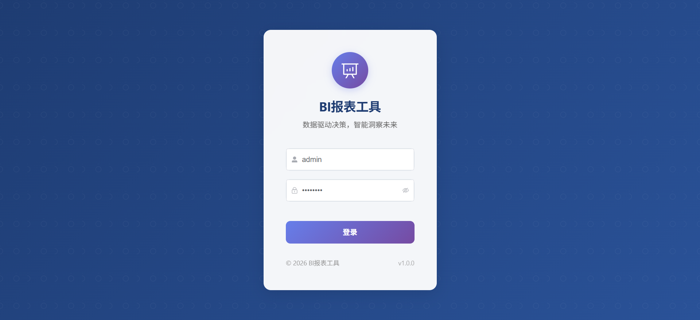
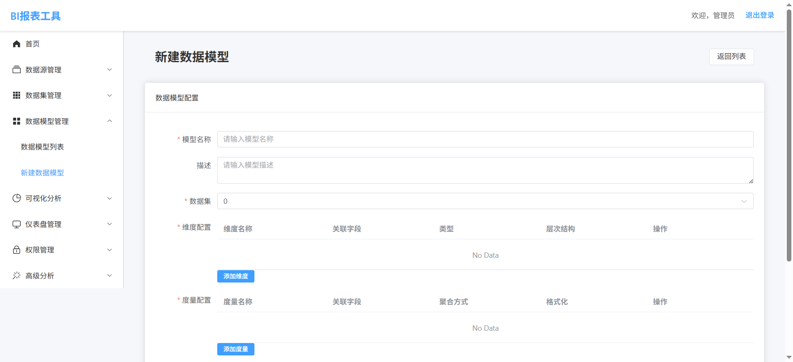

# BI报表工具

<div align="center">


一个功能完整的BI（商业智能）报表工具，支持多种数据源接入、数据建模、可视化分析、仪表盘制作、权限管理和高级分析功能。

**📣 项目特色：AI 辅助开发**
- 使用 AI 技术加速代码开发
- 智能代码生成和优化
- 自动化测试和文档生成
- 高效的开发流程

[功能特性](#功能特性) • [快速开始](#快速开始) • [文档](#文档) • [贡献](#贡献)

## 项目效果

### 仪表盘展示



### 数据分析界面



</div>

---

## 项目介绍

这是一个使用 AI 辅助开发的 BI（商业智能）报表工具，支持多种数据源接入、数据建模、可视化分析、仪表盘制作、权限管理和高级分析功能。

### 核心功能

1. **数据接入**
   - 支持多种数据源类型：MySQL、Oracle、PostgreSQL、Excel文件、API接口
   - 数据源管理：连接测试、CRUD操作、连接池配置
   - 多源并行接入，支持数据刷新频率设置

2. **数据建模与数据集创建**
   - 可视化模式：拖拽表与字段，设置筛选、分组、聚合条件
   - SQL模式：编写自定义SQL，支持复杂多表关联、计算字段
   - 数据加工：派生列、去重、排序等操作
   - 模型构建：定义维度、度量、层次结构

3. **可视化分析与报表制作**
   - 透视分析：类Excel数据透视表，支持汇总、钻取、切片等OLAP分析
   - 即席查询：自由查询数据明细，支持大数据量导出
   - 电子表格：通过Excel/WPS插件，使用熟悉的表格操作设计中国式报表
   - 图表制作：支持70+图表类型，配置样式与交互
   - 仪表盘组装：新建交互式仪表盘，添加图表、指标卡、文本等组件

4. **发布与权限管理**
   - 资源发布：将报表/仪表盘保存到指定目录，支持多终端访问
   - 权限配置：为用户/角色分配权限（只读、编辑、管理）
   - 共享协作：支持链接分享、企业门户嵌入

5. **高级分析与系统管理**
   - AI分析：使用AI技术对数据进行深度分析，生成智能洞察
   - 预测模型：创建和训练预测模型，对未来趋势进行预测
   - 宏管理：管理和执行宏命令，自动化数据处理和分析任务
   - 系统监控：监控系统性能和资源使用情况
   - 集成管理：管理与第三方系统的集成

### AI 辅助开发特色

- **智能代码生成**：使用 AI 技术自动生成高质量代码
- **代码优化**：AI 辅助识别和修复代码问题
- **自动化测试**：智能生成测试用例和测试数据
- **文档生成**：自动生成项目文档和API文档
- **开发效率**：大幅提升开发速度和代码质量
- **错误检测**：提前发现和预防潜在问题

## 技术栈

### 后端
- **框架**：Python + FastAPI
- **ORM**：SQLAlchemy
- **数据库**：SQLite（开发环境）、PostgreSQL（生产环境）
- **认证**：JWT
- **其他**：Pydantic V2（数据验证）、Passlib（密码哈希）

### 前端
- **框架**：Vue 3 + TypeScript
- **UI组件库**：Element Plus
- **路由**：Vue Router
- **状态管理**：Pinia
- **可视化**：ECharts、D3.js
- **HTTP客户端**：Axios
- **构建工具**：Vite

### AI 工具
- **代码生成**：智能代码生成和补全
- **代码审查**：自动化代码质量检查
- **文档生成**：自动创建项目文档
- **测试生成**：智能测试用例生成

---

## 快速开始

### 前置条件

- Python 3.10+
- Node.js 16+
- PowerShell 5.1+（Windows）

### 一键启动（推荐）

使用我们提供的启动脚本，可以自动安装依赖并启动前后端服务：

```powershell
# 启动所有服务
.\start.ps1

# 停止所有服务
.\stop.ps1
```

启动成功后，访问：
- 前端应用：http://localhost:5173
- 后端API：http://localhost:8000
- API文档：http://localhost:8000/docs

**默认登录账号**：
- 用户名：`admin`
- 密码：`admin123`

### 手动安装

#### 后端安装

1. 进入后端目录
   ```bash
   cd backend
   ```

2. 创建虚拟环境
   ```bash
   python -m venv venv
   ```

3. 激活虚拟环境
   ```bash
   # Windows
   venv\Scripts\activate
   
   # Linux/Mac
   source venv/bin/activate
   ```

4. 安装依赖
   ```bash
   pip install -r requirements.txt
   ```

5. 运行后端服务
   ```bash
   uvicorn app.main:app --reload --host 0.0.0.0 --port 8000
   ```
   服务将运行在 http://localhost:8000

#### 前端安装

1. 进入前端目录
   ```bash
   cd frontend
   ```

2. 安装依赖
   ```bash
   npm install
   ```

3. 运行前端服务
   ```bash
   npm run dev
   ```
   服务将运行在 http://localhost:5173

---

## 项目结构

```
bi-x/
├── backend/              # 后端代码
│   ├── app/
│   │   ├── api/          # API接口
│   │   │   └── v1/      # API版本1
│   │   │       ├── advanced/       # 高级分析
│   │   │       ├── dashboards/     # 仪表盘
│   │   │       ├── data_models/    # 数据模型
│   │   │       ├── permissions/    # 权限管理
│   │   │       ├── sources/        # 数据源
│   │   │       └── visualization/ # 可视化
│   │   ├── core/         # 核心配置
│   │   ├── models/       # 数据模型
│   │   ├── schemas/      # 数据验证模式
│   │   ├── services/     # 业务逻辑
│   │   └── main.py       # 应用入口
│   ├── requirements.txt  # 依赖文件
│   └── database.db      # SQLite数据库
├── frontend/             # 前端代码
│   ├── public/           # 静态资源
│   ├── src/              # 源代码
│   │   ├── assets/       # 资源文件
│   │   ├── components/   # 组件
│   │   ├── utils/        # 工具函数
│   │   ├── views/        # 页面
│   │   │   ├── advanced/       # 高级分析页面
│   │   │   ├── auth/          # 认证页面
│   │   │   ├── dashboards/     # 仪表盘页面
│   │   │   ├── data-models/    # 数据模型页面
│   │   │   ├── data-sets/      # 数据集页面
│   │   │   ├── data-sources/   # 数据源页面
│   │   │   ├── permissions/    # 权限管理页面
│   │   │   └── visualization/ # 可视化页面
│   │   ├── router.ts     # 路由配置
│   │   ├── main.ts       # 应用入口
│   │   └── App.vue       # 根组件
│   ├── index.html        # HTML模板
│   ├── package.json      # 依赖文件
│   └── vite.config.ts    # Vite配置
├── start.ps1            # 启动脚本
├── stop.ps1             # 停止脚本
├── START_GUIDE.md       # 详细启动指南
├── TEST_RESULTS.md      # 测试结果
└── README.md            # 项目说明
```

---

## 文档

- [启动指南](START_GUIDE.md) - 详细的启动和配置说明
- [测试结果](TEST_RESULTS.md) - 启动脚本测试报告
- [AI 开发指南](AI_DEVELOPMENT.md) - AI 辅助开发详细说明
- [贡献指南](CONTRIBUTING.md) - 项目贡献流程和规范
- [API文档](http://localhost:8000/docs) - Swagger UI（需要先启动后端）
- [API文档](http://localhost:8000/redoc) - ReDoc（需要先启动后端）

---

## 开发指南

### 后端开发

1. **模型定义**：在 `app/models/` 目录下创建数据模型
2. **模式定义**：在 `app/schemas/` 目录下创建Pydantic模式
3. **服务实现**：在 `app/services/` 目录下实现业务逻辑
4. **API接口**：在 `app/api/` 目录下创建API端点

### 前端开发

1. **页面创建**：在 `src/views/` 目录下创建页面组件
2. **路由配置**：在 `src/router.ts` 文件中配置路由
3. **组件开发**：在 `src/components/` 目录下创建通用组件
4. **状态管理**：使用Pinia进行状态管理

---

## 部署指南

### 后端部署

1. 构建生产环境依赖
   ```bash
   pip install -r requirements.txt
   ```

2. 使用Gunicorn运行FastAPI应用
   ```bash
   gunicorn -w 4 -k uvicorn.workers.UvicornWorker app.main:app
   ```

3. 配置Nginx作为反向代理
   ```nginx
   server {
       listen 80;
       server_name example.com;

       location / {
           proxy_pass http://127.0.0.1:8000;
           proxy_set_header Host $host;
           proxy_set_header X-Real-IP $remote_addr;
           proxy_set_header X-Forwarded-For $proxy_add_x_forwarded_for;
       }
   }
   ```

### 前端部署

1. 构建生产版本
   ```bash
   npm run build
   ```

2. 将 `dist` 目录下的文件部署到Nginx或其他静态文件服务器
   ```nginx
   server {
       listen 80;
       server_name example.com;

       location / {
           root /path/to/dist;
           index index.html;
           try_files $uri $uri/ /index.html;
       }
   }
   ```

---

## 常见问题

### Q: 启动时提示"未检测到 Node.js"
A: 请先安装 Node.js：https://nodejs.org/

### Q: 启动时提示"未检测到 Python"
A: 请先安装 Python：https://www.python.org/downloads/
   安装时记得勾选"Add Python to PATH"

### Q: 依赖安装失败
A: 检查网络连接，或尝试使用国内镜像源

### Q: 服务启动失败
A: 检查端口是否被占用，查看服务窗口中的错误信息

### Q: 如何修改默认账号密码？
A: 首次登录后，可以在权限管理中修改管理员密码

---

## 贡献

欢迎贡献代码！请遵循以下步骤：

1. Fork 本仓库
2. 创建特性分支 (`git checkout -b feature/AmazingFeature`)
3. 提交更改 (`git commit -m 'Add some AmazingFeature'`)
4. 推送到分支 (`git push origin feature/AmazingFeature`)
5. 开启 Pull Request

---

## 注意事项

1. **数据库配置**：开发环境使用SQLite，生产环境建议使用PostgreSQL
2. **Redis配置**：生产环境需要配置Redis用于缓存
3. **权限管理**：系统默认创建管理员用户（admin/admin123）
4. **性能优化**：对于大数据量分析，建议配置适当的缓存策略和数据库索引
5. **安全性**：生产环境中需要配置HTTPS、设置强密码策略、限制API访问频率

---

## 许可证

本项目采用 MIT 许可证 - 详见 [LICENSE](LICENSE) 文件

---

## 联系方式

如有问题或建议，欢迎提交 Issue 或 Pull Request。

---

<div align="center">

**⭐ 如果这个项目对你有帮助，请给个 Star！**

</div>
